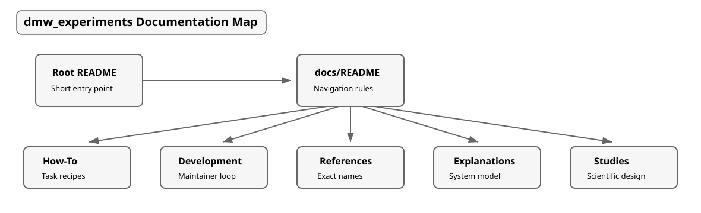

<!-- ======================================================== -->
## Table Of Contents
<!-- ======================================================== -->

1. [Using These Docs](#1-using-these-docs)
   1. [What Lives Here](#what-lives-here)
   2. [Reading Map](#reading-map)
   3. [Repository Terms](#repository-terms)

 

# 1. Using These Docs

<!-- ======================================================== -->
## What Lives Here
<!-- ======================================================== -->

This directory is the GitHub-rendered manual for `dmw_experiments`. The root
[README](../README.md) stays short enough for installation and first
use. These files hold longer task recipes, maintainer workflow, exact
references, and conceptual explanations.

|  |
|:--:|
| **Fig. 1 - Documentation Reading Map:** Start at the root README, then move into the docs file that matches the job: recipe, maintainer workflow, exact names, or system model. |

 

> [!NOTE]
> Related: use [How-To User Guides](How-To-User-Guides.md) for commands in
> order, [References](References.md) for exact names, and
> [Explanations](Explanations.md) for why the project behaves as it does.

 

<!-- ======================================================== -->
## Reading Map
<!-- ======================================================== -->

- **[How-To User Guides](How-To-User-Guides.md):** task recipes for install,
  first run, common workflows, and troubleshooting.
- **[Development](Development.md):** maintainer setup, repository routing,
  implementation standards, documentation standards, verification, and commit
  checks.
- **[References](References.md):** exact paths, commands, environment
  variables, config files, and public interfaces.
- **[Explanations](Explanations.md):** package layout, configuration model,
  dependency model, and failure model.

The first reading path is:

1. Use the root [README](../README.md) for the shortest setup route.
2. Use [How-To User Guides](How-To-User-Guides.md) for commands in order.
3. Use [References](References.md) when you need exact names.
4. Use [Explanations](Explanations.md) when you need the system model.
5. Use [Development](Development.md) before changing source files.

> [!NOTE]
> Related links:
> - Use [Development: documentation standards](Development.md#4-documentation-standards)
>   before changing docs structure or callout/link conventions.
> - Use [References: figure visual tokens](References.md#figure-visual-tokens)
>   before adding generated documentation figures.

 

<!-- ======================================================== -->
## Repository Terms
<!-- ======================================================== -->

Use these terms the same way in every docs file:

| Term | Meaning | Main Reference |
|---|---|---|
| `project root` | The repository directory that contains `pyproject.toml`, `README.md`, and `src`. | [References: project paths](References.md#project-paths) |
| `package source` | The importable Python package under `src/dmw_experiments`. | [References: project paths](References.md#project-paths) |
| `maintainer environment` | The local development environment with dependency groups installed. | [Development: maintainer loop](Development.md#maintainer-loop) |
| `runtime dependency` | A dependency needed by users of the installed package. | [Explanations: dependency model](Explanations.md#dependency-model) |
| `development dependency` | A dependency used for tests, linting, docs, profiling, or local tooling. | [References: dependency surfaces](References.md#dependency-surfaces) |

 
